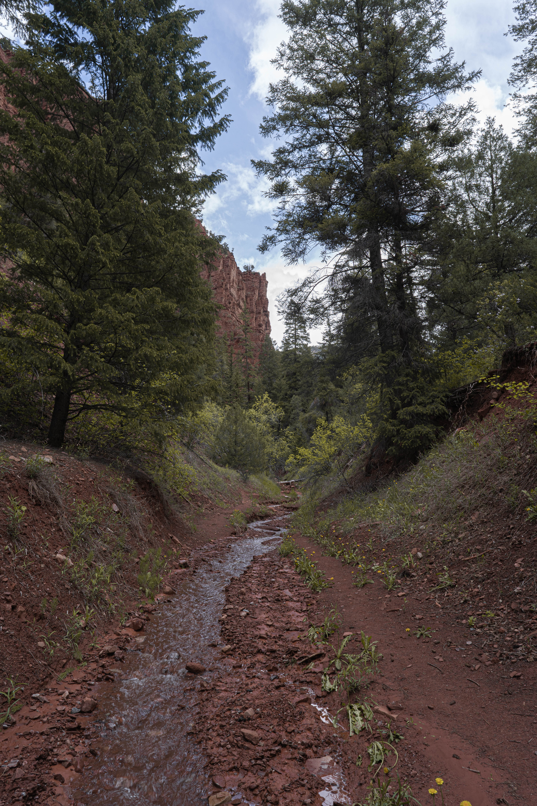

# Dylan's Blog

This is a testing ground to see how markdown is handled in VScode. So far so good as I am able to see it populate a preview in live time ont he right side fo the page. 

When it snows and Basalt turns into Narnia. Will is proudly walking across the swinging bridge with his Manhattan. 

I am looking forward to uploading more photos!

Let's try a quick update and see if this works. 

